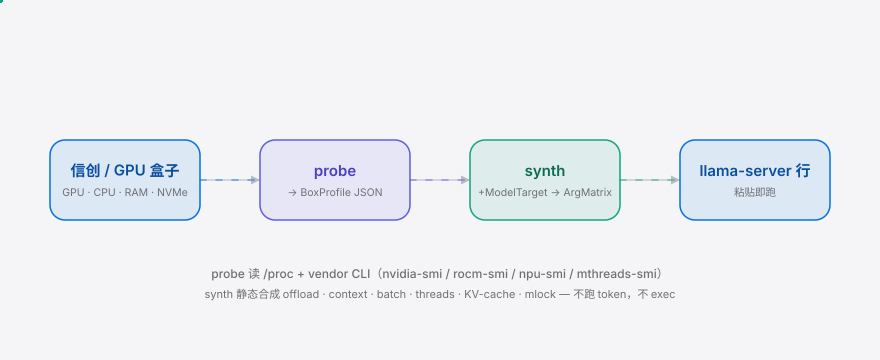
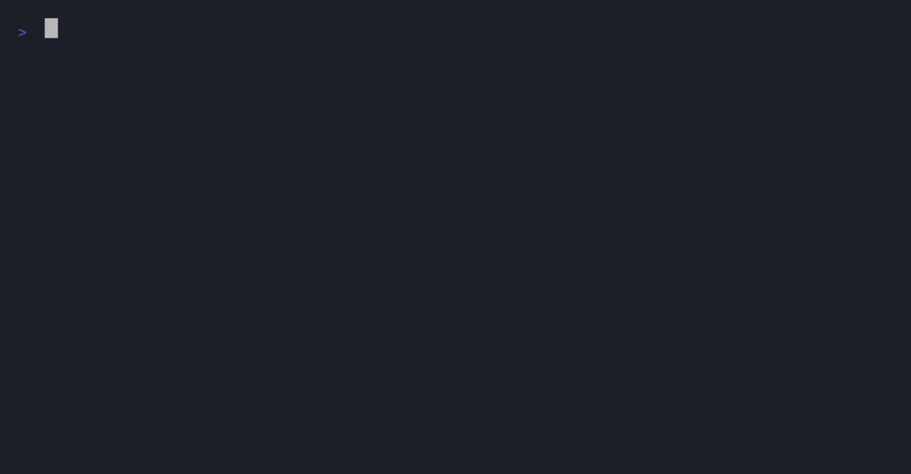

<div align="right"><sub><a href="./README.md">简体中文</a>&nbsp;&nbsp;⇄&nbsp;&nbsp;<b>English</b></sub></div>

<p align="center">
  <picture>
    <source media="(prefers-color-scheme: dark)" srcset="./assets/hero-dark.svg">
    <source media="(prefers-color-scheme: light)" srcset="./assets/hero-light.svg">
    
  </picture>
</p>

<p align="center"><sub>Hardware probe tool for 信创 (domestic) and local GPU boxes — one command synthesizes optimal llama.cpp server launch args.</sub></p>

<p align="center">
  <a href="./LICENSE"></a>
  <a href="https://github.com/SuperMarioYL/hwcfgmap/releases"></a>
  <a href="https://github.com/SuperMarioYL/hwcfgmap/actions/workflows/ci.yml"></a>
  
  
  
</p>

**Stop hand-tuning llama-server args per card per model — one command probes your 信创 / local box and synthesizes a pasteable `llama-server` launch line.** hwcfgmap reads GPU (incl. domestic-card vendor CLIs `npu-smi`/`mthreads-smi`), CPU, RAM, NVMe, and synthesizes `--n-gpu-layers` / `-c` / `-b` / `--cache-type-k` / `-t` / `--mlock` for your hardware + a target model (Qwen3 / DeepSeek / GLM-4 / Kimi-K2). From probe to launch line in under 10 seconds.

## Why now

llama.cpp exposes every `llama-server` knob and synthesizes **none of them** — every model refresh, every card swap, the operator re-reads model pages, runs trial tokens, and hand-edits the launch line. Once 27B-class models crossed the 16GB consumer-VRAM line, per-box tuning flipped from "set once" to a weekly chore. And on 信创 / data-sovereign domestic-GPU boxes (Ascend 910B / Moore Threads MTT S80 / Biren BR100), llama.cpp's offload/quant/KV-cache matrix has **zero public documentation** — hand-tuning isn't tedious, it's uncharted. This is exactly the gap that Coding Agents like [headroomlabs-ai/headroom](https://github.com/headroomlabs-ai/headroom) and Agent projects like [affaan-m/ECC](https://github.com/affaan-m/ECC) inherit when they sit directly on `llama-server` args — they need a launch line an Agent can consume, tuned to the box. hwcfgmap fills that seam: probe the box, synthesize the args, so the local Coding Agent stops trial-and-erroring across cards and models.

## Table of contents

- [Architecture](#architecture)
- [Install & quickstart](#install--quickstart)
- [Usage](#usage)
- [Demo](#demo)
- [Configuration](#configuration)
- [Roadmap](#roadmap)
- [Pricing](#pricing)
- [License](#license)

##  Architecture

One binary, one process, no daemon. It only execs vendor CLIs already on the box (`nvidia-smi` / `rocm-smi` / `npu-smi` / `mthreads-smi`) during the probe — it never spawns a second resident process. The core primitive is the **probe-and-emit** synthesizer `Synthesize(BoxProfile, ModelTarget) → ArgMatrix`: from the hardware picture + a model target, it derives the full llama.cpp arg matrix.

<picture>
  <source media="(prefers-color-scheme: dark)" srcset="./assets/atlas-dark.svg">
  <source media="(prefers-color-scheme: light)" srcset="./assets/atlas-light.svg">
  
</picture>

Core data flow: `probe` reads `/proc` + vendor CLIs → `BoxProfile` (GPU/CPU/RAM/NVMe, with domestic-card backend mapping) → `synth` does a **static synthesis** of `BoxProfile` + `ModelTarget` (per-model VRAM/KV budgets, overridable via YAML) → `ArgMatrix` (offload layers / context / batch / threads / KV-cache type / mlock) → `RenderLaunchLine` joins it into a pasteable `llama-server` line. **It runs no tokens and never execs llama-server** — it prints the command, the operator pastes it.

##  Install & quickstart

```bash
go install github.com/SuperMarioYL/hwcfgmap/cmd/hwcfgmap@latest   # 1. install (<30s)
hwcfgmap probe --model qwen3-27b                                   # 2. probe the box + synthesize (<10s)
# 3. copy the printed llama-server ... line, paste into a terminal, hit enter
```

> On a 信创 box without a Go toolchain, grab a Linux binary from [releases](https://github.com/SuperMarioYL/hwcfgmap/releases) — single file, no runtime deps.

<details><summary>Sample output (a dev box with no GPU)</summary>

```
hwcfgmap: probing box (GPU / CPU / RAM / NVMe)...
{
  "gpu": [],
  "cpu": { "physical_cores": 10, "threads": 10, "model": "Apple M1 Max" },
  "ram_bytes": 68719476736
}

# ArgMatrix
{
  "n_gpu_layers": 0,
  "context_size": 8192,
  "batch_size": 512,
  "threads": 10,
  "kv_cache_type": "q8_0",
  "mlock": true,
  "quant": "q4_k_m",
  "fit_note": "CPU-only — no GPU detected; context capped by 0.8×RAM, weights run from RAM"
}

# paste into your terminal (edit --model to your GGUF path):
llama-server --model ./qwen3-27b-q4_k_m.gguf --n-gpu-layers 0 -c 8192 -b 512 -t 10 --cache-type-k q8_0 --mlock
```

</details>

With no GPU, hwcfgmap honestly emits a CPU-only `llama-server` line (`--n-gpu-layers 0`, context capped by 0.8×RAM, `--mlock` when the weights fit in RAM). It's a starting point, not the optimal solution — see [Configuration](#configuration) and [Roadmap](#roadmap).

##  Usage

```bash
# probe only, print BoxProfile JSON (the m1 core)
hwcfgmap probe

# probe + synthesize a model target, print BoxProfile + ArgMatrix + launch line
hwcfgmap probe --model qwen3-27b
hwcfgmap probe --model glm-4
hwcfgmap probe --model deepseek-v3

# print only the launch line (for script capture)
hwcfgmap probe --model qwen3-27b --launch-only

# bake your GGUF path straight into the line
hwcfgmap probe --model qwen3-27b --gguf /data/models/qwen3-27b-q4_k_m.gguf --launch-only

# list registered model targets
hwcfgmap models
```

Model targets come from in-code defaults + `./profiles/*.yaml` overrides (see [Configuration](#configuration)). Synthesis is **deterministic and static**: keyed off documented thresholds (512MB VRAM headroom, 0.8×RAM ceiling, physical-cores → `-t`, q8_0 KV footprint) — no tokens, no autotune, no exec, reproducible output.

##  Demo



`hwcfgmap probe --model qwen3-27b`: probe the box → print BoxProfile JSON → synthesize ArgMatrix → emit the pasteable `llama-server` line. Full script in [`docs/demo.tape`](./docs/demo.tape); CI re-renders it via [`demo.yml`](./.github/workflows/demo.yml) with vhs.

##  Configuration

Model targets live in `./profiles/<id>.yaml`, overlaying in-code defaults (missing fields fall back to the built-in value — see [`internal/modeltargets/registry.go`](./internal/modeltargets/registry.go)). Registered targets:

| model id | name | default quant | recommended context | layers |
|---|---|---|---:|---:|
| `qwen3-27b` | Qwen3-27B | q4_k_m | 8192 | 64 |
| `glm-4` | GLM-4 (9B Chat) | q4_k_m | 8192 | 40 |
| `deepseek-v3` | DeepSeek-V3 | q4_k_m | 4096 | 61 |
| `kimi-k2` | Kimi-K2 | q4_k_m | 4096 | 61 |

Top-level fields of `profiles/qwen3-27b.yaml`:

| field | type | default | meaning |
|---|---|---|---|
| `id` | string | `qwen3-27b` | target id used by CLI `--model` |
| `num_layers` | int | 64 | layer count, drives offload math |
| `quants[].weight_bytes` | uint64 | see YAML | total weight footprint per quant (bytes) |
| `default_quant` | string | `q4_k_m` | quant the matrix is sized against (bring the matching GGUF) |
| `kv_cache_per_token_per_layer_bytes` | uint64 | 2048 | per-token per-layer KV footprint, drives context capping |
| `kv_cache_type` | string | `q8_0` | value for `--cache-type-k` |
| `recommended_context` | int | 8192 | `-c` starting point, then capped by VRAM/RAM |
| `recommended_batch` | int | 512 | `-b` |
| `mlock` | bool | true | whether to emit `--mlock` when RAM holds the weights |

##  Roadmap

- [x] **m1 probe hardware**: `hwcfgmap probe` reads GPU/CPU/RAM/NVMe (incl. domestic-card vendor CLI framework, stubbed for now), prints `BoxProfile` JSON; CUDA + ROCm probing work
- [x] **synthesize + CLI**: `Synthesize(BoxProfile, ModelTarget) → ArgMatrix` + `RenderLaunchLine`; `probe --model` prints the pasteable `llama-server` line
- [ ] **m3 domestic cards**: Ascend 910B / Moore Threads MTT S80 vendor-CLI probing lands, emits CANN/MUSA-aware launch lines; real-hardware verification for DeepSeek-V3 / GLM-4 / Kimi-K2
- [ ] **v0.2 fleet sync**: multi-box config sync + vendor-certified Ascend/Moore Threads profile packs (commercial)

### hwcfgmap vs hand-tuning (llama-bench + HF model card)

| axis | hwcfgmap | hand-tune (llama-bench + HF card) |
|---|:---:|:---:|
| probe the box and synthesize the full arg matrix | ✓ | ✗ (gives throughput per combo, not which combo to use) |
| cap context/offload by VRAM/cores | ✓ | partial (manual math) |
| domestic-card (Ascend/Moore Threads/Biren) backend mapping | ✓ | — (zero public docs) |
| one pasteable `llama-server` line | ✓ | ✗ (knobs scattered across docs) |
| run tokens to verify throughput | — (synthesize only, no verify) | ✓ |

hwcfgmap synthesizes but does not verify — it gives you a **starting point** tuned to your box, not a token-verified optimum. To bench throughput you still use `llama-bench`; hwcfgmap replaces the "which combo" trial-and-error, not the throughput benchmark.

##  Pricing

The OSS core of hwcfgmap (probe / synth / CLI + in-code model defaults) is **free forever**, MIT-licensed — a 信创 operator runs a single box end-to-end at no cost. The commercial path is explicit and **never weakens the OSS core**: a paid Team tier offers multi-box config sync + vendor-certified Ascend/Moore Threads profile packs, covering the hard ground that llama.cpp upstream structurally won't do and domestic-card vendors have no config docs for.

- **Team tier**: ¥19,800/year/team (≤5 boxes), extra boxes ¥3,980/box/year. Includes fleet config sync, vendor-certified profile packs, offline Ed25519 license (data-sovereign, no phone-home).
- **Enterprise tier**: offline licensing for air-gapped 信创 deployments + VAT invoice (增值税专用发票), settled via corporate contract.

The OSS CLI stays free forever; what's paid is the structurally-undocumented domestic-card profile coverage + fleet sync. The Team tier lands in v0.2. First paid path: an operator runs the free `hwcfgmap probe` on box 1 → hits "3 more Ascend boxes, profiles drift, no sync" → upgrades to Team → 1-hour fleet-sync demo → corporate contract + invoice.

##  License

[MIT](./LICENSE) © 2026 SuperMarioYL. File an issue or PR at [issues](https://github.com/SuperMarioYL/hwcfgmap/issues).

## Share this

```
hwcfgmap — one command probes your 信创/local GPU box and emits a box-tuned llama-server line. No more per-card per-model hand-tuning for the local Coding Agent. https://github.com/SuperMarioYL/hwcfgmap
```

<p align="center"><sub><a href="./LICENSE">MIT</a> © 2026 SuperMarioYL</sub></p>
