[English](README.en.md) | **简体中文**

<picture>
  <source media="(max-width: 640px) and (prefers-color-scheme: dark)" srcset="assets/presentation/hero-mobile-dark.svg">
  <source media="(max-width: 640px)" srcset="assets/presentation/hero-mobile-light.svg">
  <source media="(prefers-color-scheme: dark)" srcset="assets/presentation/hero-dark.svg">
  
</picture>

**将硬件画像与模型目标规则合成 llama-server 参数，给部署提供可检查的起点。**

`v0.2.0` · `Go 1.24+` · [MIT](LICENSE)

[Website](https://hwcfgmap.lei6393.com) · [Demo record](docs/demo-results.json)

## 为什么使用

不同模型与内存预算需要不同 offload、context 和线程设置。hwcfgmap 将探测结果整理成 BoxProfile，再用明确的模型权重与 KV 预算规则生成 ArgMatrix。它输出参数供操作者核对，不替你运行推理或做吞吐调优。

## 架构

<picture>
  <source media="(max-width: 640px) and (prefers-color-scheme: dark)" srcset="assets/presentation/architecture-mobile-dark.svg">
  <source media="(max-width: 640px)" srcset="assets/presentation/architecture-mobile-light.svg">
  <source media="(prefers-color-scheme: dark)" srcset="assets/presentation/architecture-dark.svg">
  
</picture>

probe 读取系统信息与可用的 vendor CLI；modeltargets 提供代码内默认值和 YAML 覆盖；synth.Synthesize 根据 RAM、VRAM 和物理核数生成参数，RenderLaunchLine 输出命令文本。NVMe 计数只是累计读取字节，不是带宽测量。

完整字段在 [profile/box.go](internal/profile/box.go)、[modeltargets/registry.go](internal/modeltargets/registry.go) 与 [synth/matrix.go](internal/synth/matrix.go)。示例直接调用合成函数，输入完全在源码中给出。

## 安装

需要 Go 1.24+。示例的硬件数据是显式 fixture，不探测本机，也不需要模型文件。

```bash
git clone https://github.com/SuperMarioYL/hwcfgmap.git
cd hwcfgmap
go build -o hwcfgmap ./cmd/hwcfgmap
```

## 快速开始

实际读取模型注册表，并将 8 核、64 GiB RAM、无 GPU 的构造输入送进真实合成函数。输出是静态估算，不是运行验证或最优参数。

```bash
go run ./cmd/hwcfgmap models
go run ./examples/presentation
```

完整输入在 [examples/presentation/main.go](examples/presentation/main.go)。输出中的 ./example.gguf 是供替换的路径文本，未被打开或执行。

## 使用

probe 输出 BoxProfile；probe --model ID 追加参数与启动行；--launch-only 只输出命令，--gguf 指定命令中的模型路径。models 列出注册目标，--profiles 选择 YAML 目录。实际硬件探测的完整程度取决于系统信息和 vendor CLI。

## 实际 Demo

<picture>
  <source media="(max-width: 640px) and (prefers-color-scheme: dark)" srcset="assets/presentation/process-mobile-dark.svg">
  <source media="(max-width: 640px)" srcset="assets/presentation/process-mobile-light.svg">
  <source media="(prefers-color-scheme: dark)" srcset="assets/presentation/process-dark.svg">
  
</picture>

### 读取模型规则

列出本地注册表及默认 context 和 quant。

```text
$ go run ./cmd/hwcfgmap models
qwen3-27b       Qwen3-27B               q=q4_k_m  ctx=8192  layers=64
deepseek-v3     DeepSeek-V3             q=q4_k_m  ctx=4096  layers=61
glm-4           GLM-4 (9B Chat)         q=q4_k_m  ctx=8192  layers=40
kimi-k2         Kimi-K2                 q=q4_k_m  ctx=4096  layers=61
```

### 合成 fixture 参数

从完整 CPU-only 输入生成参数与未执行的启动行。

```text
$ go run ./examples/presentation
{
  "input": {
    "gpu": [],
    "cpu": {
      "physical_cores": 8,
      "threads": 16,
      "numa_nodes": 0,
      "model": "fixture CPU"
    },
    "ram_bytes": 68719476736
  },
  "arguments": {
    "n_gpu_layers": 0,
    "context_size": 8192,
    "batch_size": 512,
    "threads": 8,
    "kv_cache_type": "q8_0",
    "mlock": true,
    "offload_layer": 0,
    "quant": "q4_k_m",
    "exec_binary": "llama-server",
    "backend": "cpu",
    "fit_note": "CPU-only — no GPU detected; context capped by 0.8×RAM, weights run from RAM"
  },
  "launch": "llama-server --model ./example.gguf --n-gpu-layers 0 -c 8192 -b 512 -t 8 --cache-type-k q8_0 --mlock"
}
```

## 能力与接入

<picture>
  <source media="(max-width: 640px) and (prefers-color-scheme: dark)" srcset="assets/presentation/integrations-mobile-dark.svg">
  <source media="(max-width: 640px)" srcset="assets/presentation/integrations-mobile-light.svg">
  <source media="(prefers-color-scheme: dark)" srcset="assets/presentation/integrations-dark.svg">
  
</picture>

模型目标包括 qwen3-27b、glm-4、deepseek-v3 和 kimi-k2 的内置规则。请按实际权重与推理服务版本核对 YAML，再在目标硬件上测试启动与吞吐。


## 配置

YAML 可设置 num_layers、quants[].weight_bytes、default_quant、kv_cache_per_token_per_layer_bytes、kv_cache_type、recommended_context、recommended_batch、mlock 和 exec_binary。静态规则预留显存余量并按 RAM 封顶 context；不是对所有设备拓扑的完整内存仿真。

## 路线图与范围

当前提供画像数据模型、可用 vendor 探测、注册表和静态合成。v0.2.0 落地了国产卡 vendor CLI 的显存解析：昇腾 `npu-smi info` 表格（NPU 型号 + HBM/Memory-Usage 显存池，解析行为已用真实采集的 910B1 / 910PremiumA 输出做 fixture 验证）与摩尔线程 `mthreads-gmi -q -j` JSON（型号 + memory_total）；识别不了的输出形态一律退回"如实上报 0 显存"的存在性探测，绝不猜数字。合成输出对 CANN/MUSA 盒子带 backend 字段与构建提示。壁仞 bre-smi 仍为存在性探测（无可验证的公开输出格式）。真实硬件上的验证、多盒同步和认证 profile 服务仍为后续方向，没有可声称已上线的付费 fleet 产品。

- 参数由静态模型推导，不是实测最优解或部署成功保证。
- 国产卡解析按采集到的 CLI 输出形态验证，尚未在实体硬件上跑通；本示例没有验证 GPU backend 或多卡拓扑。
- NVMe 字节计数不是吞吐率。

[Terminal recording](assets/demo.gif) · [Recording script](docs/demo.tape)

## 许可证

[MIT](LICENSE)
